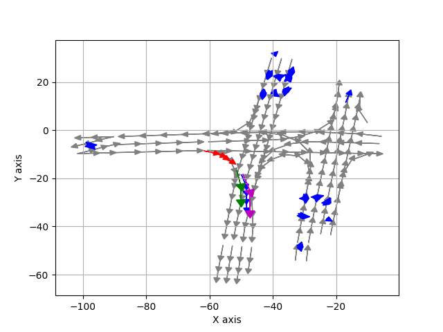
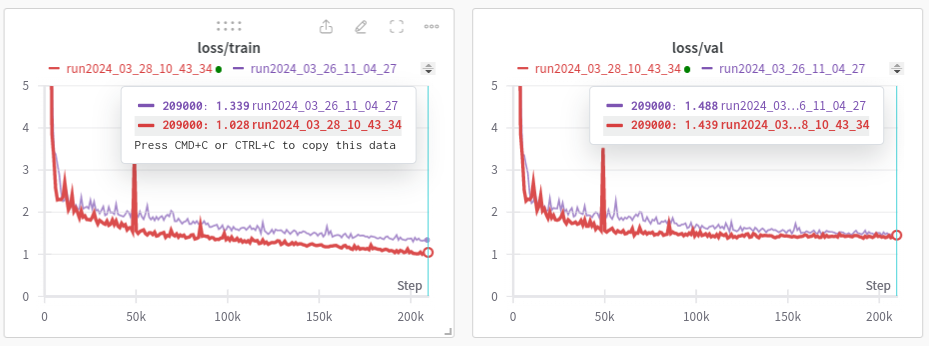

# Argo_llama
Train the Argoverse dataset on the LLaMA network (adapted from [LLaMA2.c](https://github.com/karpathy/llama2.c)).

## Changes in the LLaMA Network: 
- Input dim [6, 256]
  - 256 is the sequence length
  - 6 is vector length
  Agent paths and map segments are represented as vectors:
  - `[x0,y0, x1, y1, type, timestamp]`
  -  x, y are offset by the av's position at prediction time.
  - timestamp are offset at prediction time.
- Output dim [1, 6]
  - `[x1,y1,x2,y2,x3,y3]`
  - agent's future position at 1,2,3 seconds

- The attention layer `is_causal` is set to `false` to allow the network to see the entire sequence. 
- Remove the positional encoding and train the sequence as a bag of words.
- After stacks of transformer layers, add an average pooling layer to reduce the dimension, followed by a MLP to predict the output.

# Usage
- Install dependency:
  ```bash
  conda create -n argo_llama python==3.10
  pip install -r requirements.txt
  ```
- Install the [Argoverse API](https://github.com/argoverse/argoverse-api.git). 
- Check out the sample data and checkpoints: cd to the repo directory and runing:
  ```bash
  conda activate argo_llama
  python3 run.py prep
  python3 run.py train
  python3 run.py viz
  ```

# 
- gt (magenta)
- prediction (green)

 

# Training
| Model          | Dimension | Layers | Heads | Parameters |
|----------------|-----------|--------|-------|------------|
| Smaller Model  | 64        | 4      | 16    | 264,768    |
| Bigger Model   | 128       | 8      | 16    | 2,102,208  |
 
 