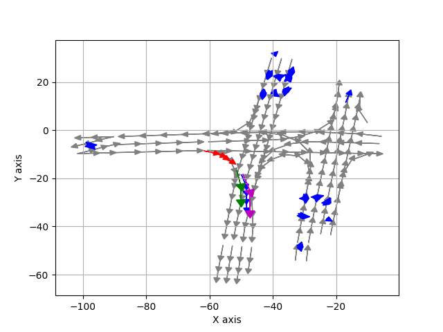

# Argo_llama
Train the Argoverse dataset on the LLaMA network (adapted from [LLaMA2.c](https://github.com/karpathy/llama2.c)).

## Changes in the LLaMA Network Structure:
1. The attention layer `"is_causal"` is set to `false` to allow the network to see the entire sequence. 
2. Remove the positional encoding and train the sequence as a bag of words.
3. After stacks of transformer layers, add an average pooling layer to reduce the dimension, followed by 2 MLPs to predict the output.

# Usage
- Install the Argoverse API from [Argoverse API GitHub repository](https://github.com/argoverse/argoverse-api.git). Prepare the Argoverse data into `.pkl` format.
- Install dependency:
  ```bash
  conda create -n trans_argo python==3.10
  pip install -r requirements.txt
  ```
- Check out the sample data and checkpoints: cd to the repo directory and runing:
  ```bash
  conda activate trans_argo
  python3 run.py prep
  python3 run.py train
  python3 run.py viz
  ```

# 
- red: agent previous path
- magenta: agent gt path
- green: agent predicted path
- blue: others path
 
