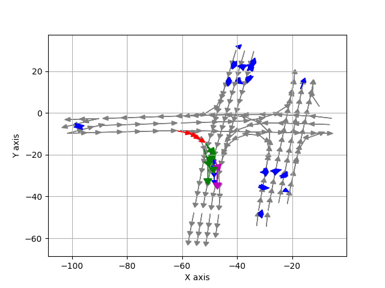
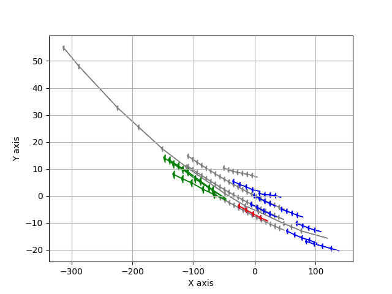

# Argo_Llama :car: :llama:
The goal of this project is to predict future trajectory using the simplest input representation and networks possible. We aim to minimize the domain-specific knowledge and leverage the capabilities of the transformer model to handle all aspects of the task.
- We chose the argoverse v1 dataset due to its ease of use.
- The model uses only self-attention transformer (adapted from [LLaMA2.c](https://github.com/karpathy/llama2.c)).
- checkpoint can be found on [huggingface](https://huggingface.co/dalaska/drive_llama).

## Usage :hammer_and_wrench:
- Install dependency:
  ```bash
  conda create -n argo_llama python==3.10
  pip install -r requirements.txt
  ```
- Install the [Argoverse API](https://github.com/argoverse/argoverse-api.git). 

- Prepare input data for training:
  ```bash
  conda activate argo_llama
  python3 run.py prep
  ```
- Train the model:
  To run on a single GPU small debug run, example:
  ```bash
  python3 train.py
  ```
  
  To run with DDP on 4 gpus on 1 node, example:

  ``` bash
  torchrun --standalone --nproc_per_node=4 train.py
  ```

- evaluate the model and visualize the results: (Check out the sample data and checkpoints)
 
  ``` bash
  python3 run.py viz
  ```

## Model:

### Input Output representation:
Input dimension: [batch_size, seq_len, c]

- "c" represents the channel dimension. Object paths and maps are represented using line segments with types [x0, y0, x1, y1, type]. Here, (x0, y0) denotes the start position, and (x1, y1) denotes the end position. 
- "x" and "y" are offset by the AV's position at prediction time.
- Object previous paths are sampled using a fixed step, but the timestamp is not represented in the input data, requiring the model to learn it.
- "seq_len" represents the sequence length. To maintain a fixed input size, sequences exceeding the maximum size are truncated. Padding with [0,0,0,0,-1] is added if the sequence is shorter than the maximum size. No mask is applied for the padding; the model learns to recognize padding as a special token.

### Changes to the LLaMA model: 

- Positional encoding is removed, and the sequence is trained as a bag of tokens.
- The attention layer's is_causal parameter is set to false to enable the network to observe the entire sequence.
- The model aggregates information to the first token and use a linear layer to reduce the output dimension to the desired size.
- Sample result visualization: Ground truth (magenta), Prediction (green)

 

### Loss :chart_decreasing:
Our model is designed to generate multiple paths, whereas the ground truth consists of only one path. For example, at junctions, we expect the model to generate options for all possible turns. 
We use the loss of the path with the smallest L2 loss. This strategy encourages the model to explore various possibilities. Since the gradient of the min function is discontinuous, we employ the softmin function as a weighting factor to ensure smoother optimization.

### Data loader:
In the data loading process, a random rotation is applied to all vectors. This approach significantly reduces overfitting and enhances the model's ability to learn rotation invariance :warning:.

### Use on your own data :arrows_counterclockwise:
When transferring the model to your own data, we found that rotating the coordinates by a 45-degree angle improves performance :warning:. 
The model exhibits non-rotation invariance even we add the random rotation in the training. This is due to the Loss funtion. When near the axes, the effect of one dimension is much more pronounced. Rotating the coordinates by 45 degrees compensates for this discrepancy, as both the x and y coordinates contribute roughly equally to the loss.

